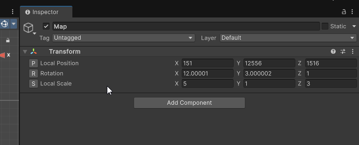
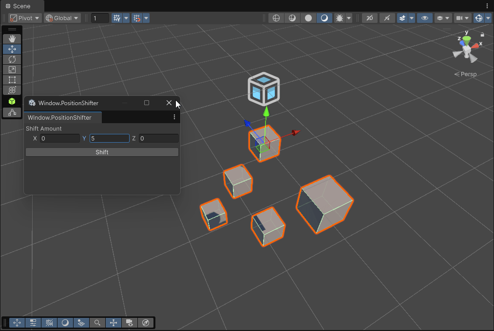

# Editor Tools

Tools I built or adapted from ideas that inspired me throughout my game development work:

## 1. RoadMaker

This tool helps to create interconnected cubes based on the user's click location.

## 2. JsonUtility

This tool supports the conversion and usage of the JSON format.

## 3. BetterTransformInspector

This script customizes the Transform Inspector, adding buttons to quickly reset Position (0,0,0), Rotation (0,0,0), and Scale (1,1,1).

## 4. PositionShifter

This tool allows you to shift a number of GameObjects by a specific value.

